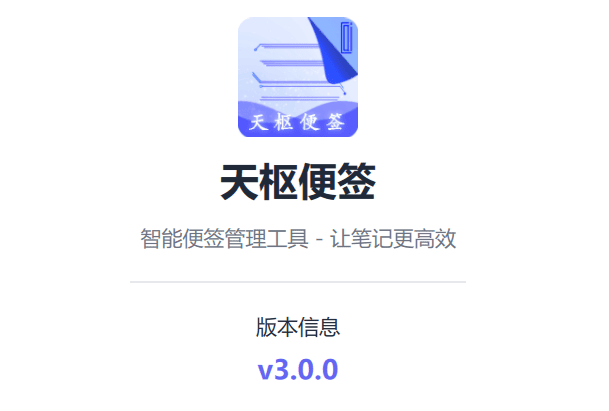
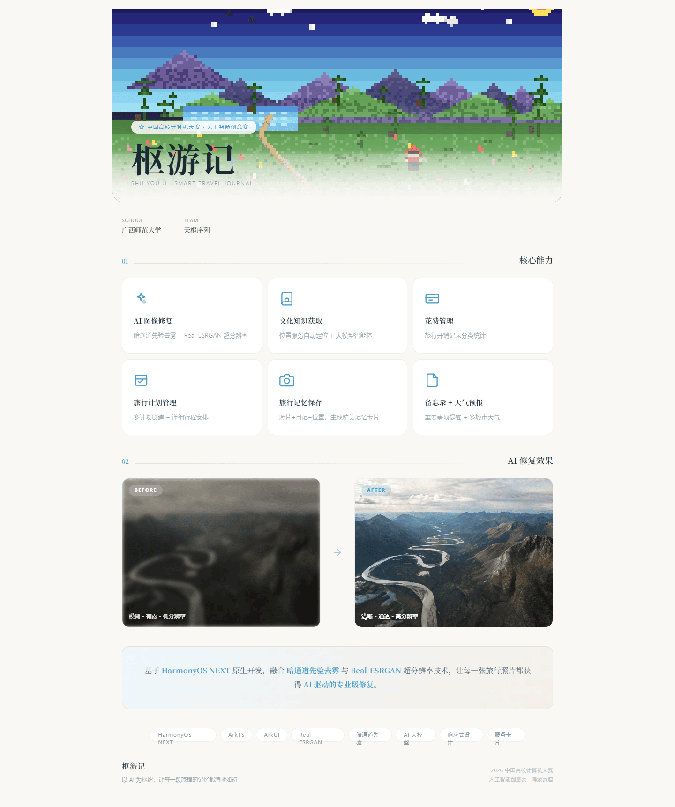
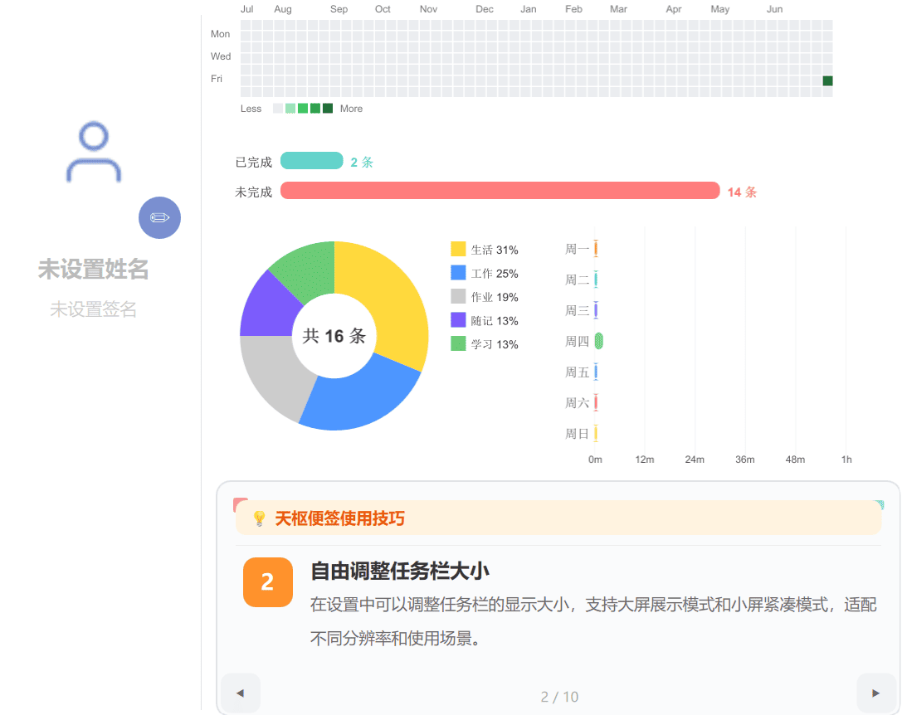

<div align="center">


# 天枢序列 · Tianshu Sequence

### 以代码书写未来 —— AI 原生应用创新团队官网


> 我们是一支由青年开发者组成的创新团队，专注于 AI 与原生体验的深度融合。
> 从桌面效率工具到鸿蒙生态应用，每一行代码都在重新定义人与数字世界的交互方式。

**🔥 在线预览：https://yan-stone-computer.github.io/tianshu-sequence/**

</div>

---

## ✨ 亮点一览

| | 特色 |
|---|---|
| 🎨 | **大厂级设计**：深色 Hero + 橙色品牌视觉，动效细腻 |
| 🚀 | **零依赖**：纯 HTML / CSS / JS 实现，无需构建即可运行 |
| ⚡ | **沉浸式交互**：粒子网络背景、滚动揭示、数字动画、图片灯箱 |
| 📱 | **完全响应式**：桌面 / 平板 / 手机全端适配 |
| 🧩 | **模块化结构**：团队介绍、产品矩阵、技术愿景一应俱全 |

---

## 📦 产品矩阵

### 天枢便签 · PolarisNote

> 融合 AI 智能助手、看板式管理与富文本编辑于一体的下一代效率神器。数据本地存储、隐私至上，Windows / Linux 全平台原生支持。

- 🗂️ 类 Trello 看板布局，多任务栏灵活组织工作流
- 🤖 AI 生成便签、续写内容、分析文档、智能问答
- 🔐 数据全部本地 SQLite 存储，绝不上云
- 📊 GitHub 风格数据仪表盘，多维度可视化
- 🔓 完全开源免费

🔗 [产品官网](https://yan-stone-computer.github.io/polarisnote-web/) · [源代码仓库](https://github.com/yan-stone-computer/PolarisNote)

### 枢游记 · ShuYouJi

> 基于 HarmonyOS NEXT 原生开发的 AI 智能旅行助手。图像修复、文化知识、行程规划、花费管理，让每一次旅行都更值得铭记。

- 🖼️ AI 图像修复：去雾、超分、锐化、色彩增强一站式处理
- 🧭 AI 智能客服：意图识别 + 指令模式，自然语言管理旅行
- 📔 图文旅行日记：与花费管理智能联动
- 📱 手机 / 平板双端原生适配

🔗 [产品官网](https://yan-stone-computer.github.io/ShuYouJi-Web/)

### 陈汉升 · ChenHanshen

> 把《我真没想重生啊》里的陈汉升装进手机——原生安卓 AI 角色扮演 App。人情世故、恋爱技巧、职场江湖，啥都能聊。

- 🗣️ 陈汉升人格对话：口头禅、笑声、见人下菜的语气与江湖智慧，深度还原角色
- 🖼️ 发图识图 + AI 生图：内置国内免费引擎，零配置开箱即用
- 🧠 1000+ 章剧情知识库 + 会话记忆
- 🔒 Key 只存本机，聊天记录本地保存，纯 Kotlin 原生开发

🔗 [产品官网](https://yan-stone-computer.github.io/awesome-chenhansheng-app/) · [源代码仓库](https://github.com/yan-stone-computer/awesome-chenhansheng-app)

---

## 🖥️ 界面预览

<div align="center">

**Hero 主视觉**



**产品矩阵 · 技术愿景**




</div>

---

## 🛠️ 技术栈

| 技术 | 用途 |
|---|---|
| HTML5 + CSS3 | 语义化结构与大厂级视觉设计 |
| JavaScript (ES6+) | 交互逻辑与动画 |
| CSS Custom Properties | 主题变量，全站统一配色 |
| IntersectionObserver | 滚动揭示动画 |
| Canvas 2D | Hero 粒子网络背景 |

---

## 🚀 本地运行

无需任何依赖，任选其一：

```bash
# 方式一：Python
python -m http.server 8080

# 方式二：Node.js
npx serve .

# 方式三：VS Code Live Server
# 右键 index.html → Open with Live Server
```

然后浏览器访问 `http://localhost:8080` 即可。

---

## ☁️ 部署到 GitHub Pages

本仓库已内置 **GitHub Actions 自动部署**，只需两步：

1. **创建仓库**：在 GitHub 新建仓库（建议名称 `tianshu-sequence`），将本目录内容推送上去
2. **开启 Pages**：仓库 `Settings → Pages → Source` 选择 `GitHub Actions`

之后每次 `git push`，工作流会自动构建并发布到：

```
https://<你的用户名>.github.io/tianshu-sequence/
```

> 手动方式：也可将 `Source` 选择为 `Deploy from a branch` → `main` → `/ (root)`。

---

## 🤝 贡献指南

欢迎任何形式的贡献：

- 🐛 发现 Bug → 提交 [Issue](https://github.com/yan-stone-computer/tianshu-sequence/issues)
- 💡 新功能建议 → 提交 Issue 并附带方案
- 🎨 设计优化 → Fork 后提交 Pull Request

```bash
git clone https://github.com/yan-stone-computer/tianshu-sequence.git
cd tianshu-sequence
# 修改后
git add .
git commit -m "feat: describe your change"
git push
```

---

## 📄 License

本项目基于 [MIT License](./LICENSE) 开源，欢迎自由使用与二次开发。

---

<div align="center">

**天枢序列 · Tianshu Sequence**

以代码书写未来 · 让 AI 成为每个人触手可及的伙伴

<a href="https://github.com/yan-stone-computer">GitHub</a> · 
<a href="https://yan-stone-computer.github.io/polarisnote-web/">天枢便签</a> · 
<a href="https://yan-stone-computer.github.io/ShuYouJi-Web/">枢游记</a> · 
<a href="https://yan-stone-computer.github.io/awesome-chenhansheng-app/">陈汉升</a>

© 2026 天枢序列 Tianshu Sequence. All rights reserved.

</div>
